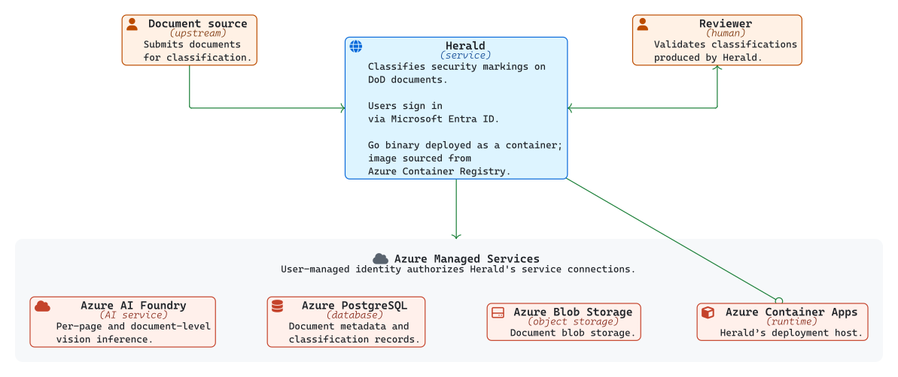
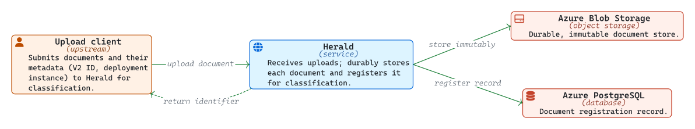
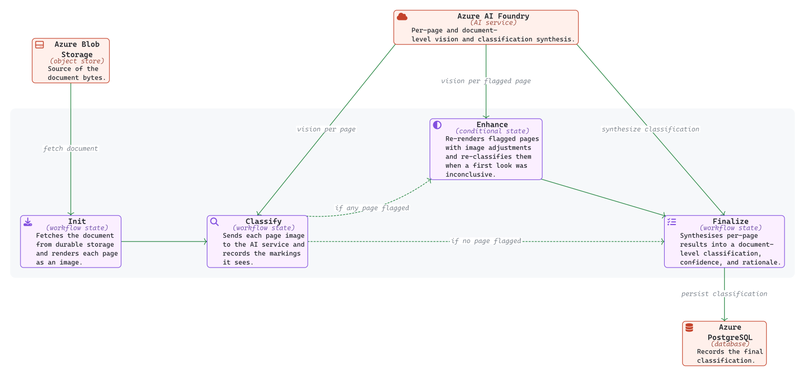
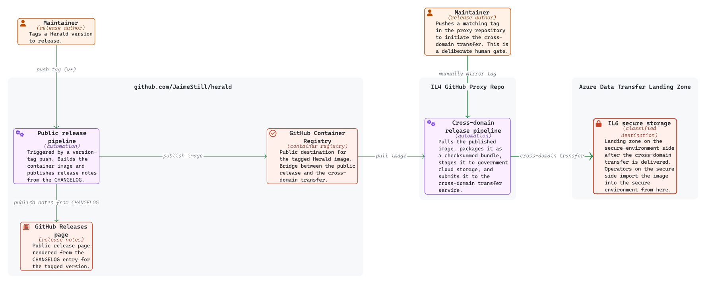

# [Herald - OV-1 Brief](https://github.com/JaimeStill/herald)

> If you are viewing this as a PDF and the diagrams are difficult to see, try viewing it [directly on GitHub](https://github.com/JaimeStill/herald/blob/main/_project/ov-1/README.md)

<picture>
  <source media="(prefers-color-scheme: dark)" srcset="./core/readme-dark.svg">
  
</picture>

Herald is a Go web service that reads security classification markings on uploaded DoD PDF documents and turns them into structured records. It leans on Azure AI Foundry to interpret each page, Azure PostgreSQL to keep the classification record, Azure Blob Storage to hold documents durably, and Azure Container Apps as its deployment host. The picture above shows where Herald sits in that broader system.

## Upload

<picture>
  <source media="(prefers-color-scheme: dark)" srcset="./core/upload-dark.svg">
  
</picture>

A document enters Herald through a single upload step: the upstream system hands Herald the file along with metadata identifying the document — including the V2 document ID and the instance of V2 the document is associated with — so classifications can be tied back to the document's record in V2. Herald stores the bytes in durable, immutable storage and registers a record for the document in its database, then returns an identifier the upstream system can use to track classification results. Documents are immutable once stored; every later step attaches results to the registered record.

## Classification

<picture>
  <source media="(prefers-color-scheme: dark)" srcset="./core/classification-dark.svg">
  
</picture>

Herald examines a document one page at a time. After fetching the file from durable storage and rendering each page as an image, it sends every page to the AI service in parallel and records the markings it sees. When a first look is inconclusive on any page, Herald re-renders those pages with image adjustments and re-classifies them. A final synthesis step reviews everything together and produces the document-level classification, confidence, and rationale; classifications with low confidence are routed to a human reviewer for validation, while high-confidence results stand on their own.

## Release

<picture>
  <source media="(prefers-color-scheme: dark)" srcset="./core/release-dark.svg">
  
</picture>

When a maintainer tags a Herald version, an automated pipeline builds the container image and publishes it to a public registry alongside human-readable release notes. A deliberate human gate then mirrors the tag in a proxy repository on the IL4 GitHub instance, kicking off a second pipeline that packages the image, stages it to government cloud storage, and submits it to a cross-domain transfer service. The transfer delivers the image to a secure storage destination on the IL6 side. Once GitHub Actions become available on the IL6 GitHub instance, an IL6-side release workflow will be built to complete the automated deployment update; today, IL6 operators import the image into the secure environment manually.
