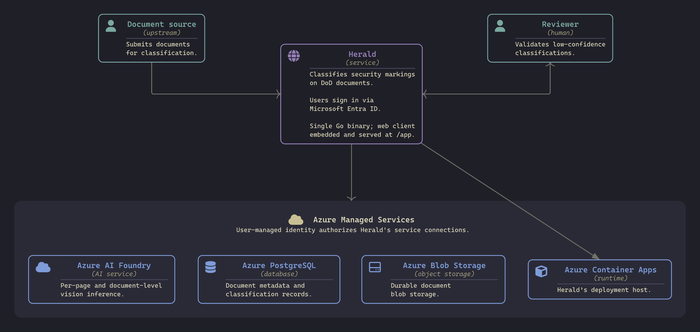
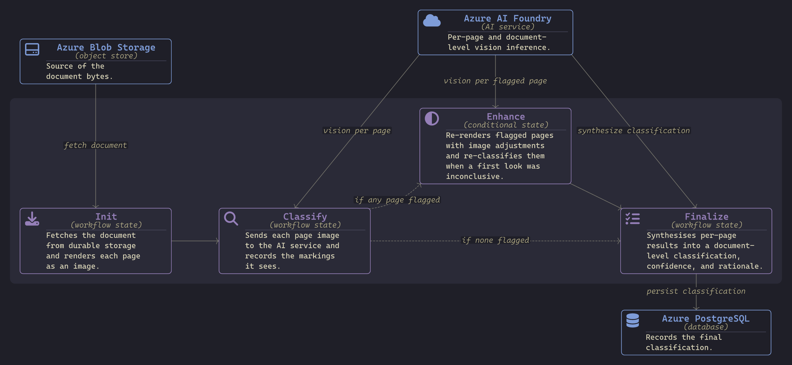
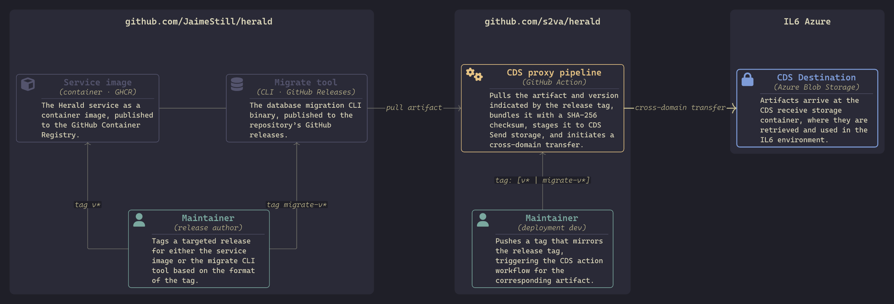

Overview
===

A legacy program of record contains roughly **750,000 classified documents** that need a
classification record attached to each one. Verifying them by hand is prohibitively slow and
expensive.

Herald is a Go web service that reads the security markings on a document and returns a
structured classification — the **classification** itself, a **confidence** rating
(low / medium / high), and the **reasoning** behind it.



<!-- end_slide -->

Scope
===

This briefing covers, in order:

1. **Overview** — what Herald does and why
2. **Herald, live** — a working demonstration
3. **A minimal footprint** — dependencies and supply-chain exposure
4. **TAU agent example** — the raw agent library underneath Herald
5. **Distribution** — release and cross-domain delivery to IL6
6. **Close** — results, cost, and questions

<!-- end_slide -->

<!-- jump_to_middle -->

Herald, live
===

<!-- end_slide -->

Classification workflow
===

A document is fetched from storage and rendered to page images, every page is classified in
parallel, inconclusive pages are re-rendered and re-checked, and a final step synthesizes the
document-level classification. The demo walks an image and a PDF through this flow.



<!-- end_slide -->

Demo
===

Startup the service container stack — Postgres + Azurite, then the Go server and embedded web client:

```bash
mise run stack:up    # Postgres + Azurite, migrations applied
mise run dev:auth    # Go server (air) + web client (bun), Entra overlay
```

Walkthrough — `http://localhost:8080/app`:

1. **Upload an image** — `_project/marked-documents/images/marked-document.12.png`
2. **Upload a PDF** — `_project/marked-documents/escalation-secret-to-noforn.pdf`
3. **Classification workflow** — per-page analysis → document-level result
4. **Review view** — classification, confidence, and reasoning side-by-side with the document
5. **Prompts view** — the named prompts that drive each workflow stage
6. **Container App** - see Herald live in Azure at: `https://herald-app.politebay-a10e5b18.centralus.azurecontainerapps.io/app`

<!-- end_slide -->

<!-- jump_to_middle -->

A minimal footprint
===

<!-- end_slide -->

A small, isolated footprint
===

Herald applies lessons learned from previous classified development projects. The question driving its
architecture: what does **sustainable, cloud-native** software look like when you build against
**open standards** and refuse the frameworks and shortcuts that come back to bite you?

The underlying libraries are structured in such a way that they isolate third-party dependencies. The `provider` library defines a dependency-free **interface** that is used by higher-level libraries and services. Vendor SDKs live in **sub-modules** and only enter a build when you explicitly import and use it. Herald imports `provider/azure`, so it pulls in the Azure SDK dependencies, but avoids pulling in the AWS SDK dependencies.

The web client is embedded into the Go binary (via `go:embed`) and served at `/app`. The whole platform can be deployed as a single binary within a container image.

<!-- new_lines: 6 -->

<!-- column_layout: [1, 1, 1] -->

<!-- column: 0 -->

<!-- alignment: center -->

**Core Libraries** — `tailored-agentic-units/*`

```text
protocol       0 deps  ← contracts
format         0 deps  ← interface
 ├ converse     0 deps
 └ openai       0 deps
provider       0 deps  ← interface
 ├ azure        Azure SDK
 ├ bedrock      AWS SDK
 └ ollama       0 deps
agent          uuid
orchestrate    uuid
```

<!-- column: 1 -->

<!-- alignment: center -->

**Herald Service** — `go.mod`

```text
Azure SDK
  azcore · azidentity · azblob
coreos/go-oidc/v3
golang-migrate/migrate/v4
google/uuid
jackc/pgx/v5
pdfcpu/pdfcpu
golang.org/x/sync
```

<!-- column: 2 -->

<!-- alignment: center -->

**Herald Client** — `package.json`

```json
"dependencies": {
  "@azure/msal-browser",
  "lit"
}
"devDependencies": {
  "@types/bun"
}
```

<!-- reset_layout -->

<!-- end_slide -->

No framework, by design
===

The client leans on the **web platform**, not a framework stack — no React, Vue, Angular, or
Svelte, and no Tailwind, Bootstrap, or MUI. We build with what the browser already does well.

<!-- column_layout: [1, 1] -->

<!-- column: 0 -->

**Lit → native Web Components**

`lit` only emits standard custom elements the browser runs directly. They compose in three tiers:

- **View** — route-level composition · `hd-documents-view`
- **Module** — owns state, calls services · `hd-document-grid`
- **Element** — pure: props in, events out · `hd-document-card`

Data flows down via `@property`, events up via `CustomEvent`.
*Element = brick, module = building, view = scene.*

<!-- column: 1 -->

**A design system we own**

Token-based, native CSS — nothing to install:

- Design tokens as CSS custom properties, themed with `light-dark()`
- Cascade layers order the system: `tokens · reset · base · theme · app`
- Component styles via `*.module.css` → `CSSStyleSheet`
- Shared styles: `badge · buttons · cards · inputs · labels · scroll`
- Overlays use native top-layer primitives — no `z-index` arms race

<!-- reset_layout -->

The modern web platform is mature enough to build powerful applications on standard features alone, shedding
a framework's **complexity**, runtime **inefficiency**, **vulnerability surface**, and ongoing **maintenance burden**.

<!-- end_slide -->

TAU agent example
===

Herald isn't a disposable, one-off monolith — it's assembled from **reusable TAU libraries**.
The same agent stack runs standalone. The `prompt-agent` example CLI swaps provider and format
by **config alone**: here, AWS Bedrock + Claude with the `converse` format. The agent is a
configurable client over a driver registry — much like Go's `database/sql` interfaces with any
SQL server through a swappable driver.

```bash
cd ~/tau/examples && aws login    # Bedrock auth via the AWS CLI

go run ./cmd/prompt-agent \
  -config ./cmd/prompt-agent/config.bedrock.json \
  -prompt "What is infrastructure as code? 300 words or less" \
  -stream

# vision works the same way — just add the protocol and an image:
go run ./cmd/prompt-agent \
  -config ./cmd/prompt-agent/config.bedrock.json \
  -protocol vision \
  -images "https://w.wallhaven.cc/full/zp/wallhaven-zpoxyj.png" \
  -prompt "Describe what you see." \
  -stream
```

Same CLI, three drivers — only the config changes:

<!-- column_layout: [1, 1, 1] -->

<!-- column: 0 -->

<!-- alignment: center -->

**`config.ollama.json`** — Ollama

```json
"provider": {
  "name": "ollama",
  "base_url": "http://localhost:11434"
},
"model": { "name": "ministral-3:8b" }
```

<!-- column: 1 -->

<!-- alignment: center -->

**`config.azure.json`** — Azure

```json
"provider": {
  "name": "azure",
  "options": { "deployment": "gpt-5-mini" }
},
"model": { "name": "gpt-5-mini" }
```

<!-- column: 2 -->

<!-- alignment: center -->

**`config.bedrock.json`** — AWS

```json
"provider": {
  "name": "bedrock",
  "options": { "region": "us-east-2" }
},
"format": "converse",
"model": { "name": "claude-haiku-4.5" }
```

<!-- reset_layout -->

<!-- alignment: left -->

See `https://github.com/tailored-agentic-units/examples` for more examples, including the `orchestrate` library that adds state-graph workflow capabilities.

<!-- end_slide -->

<!-- jump_to_middle -->

Distribution
===

<!-- end_slide -->

Release to IL6
===

A tag on `JaimeStill/herald` publishes the artifacts publicly; a matching tag on the `s2va/herald`
proxy mirrors them across security domains to IL6 — a deliberate human gate between the two.



<!-- end_slide -->

Close
===

Herald is, first and foremost, a **REST API**. The web client exists to demonstrate the service
and to give reviewers a place to validate low-confidence classifications — the integration path
is the API itself.

- **Deployed to IL6 Azure** — running today in the secure environment.
- **25 documents tested at 100% classification accuracy.**
- **Projected cost for the full run:** ~**$27k** in inference plus ~**one month** of managed
  services to process all **750,000** documents.

<!-- new_lines: 2 -->

Open for questions.

<!-- end_slide -->
